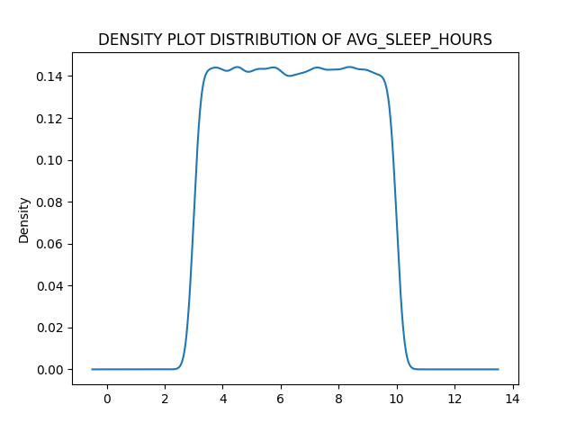

# **HEALTH AND LIFESTYLE T-TEST ANALYSIS**

### OVERVIEW
---
T-test is an inferential statistical method commonly used to compare the mean(s) of 2 groups i.e sample and population. It is used to check if there's a significant difference between the mean(s) of the 2 groups. 

### About Dataset
---
The health and lifestyle dataset was downloaded from [Kaggle](www.kaggle.com). The dataset contains health records of 100,000 individuals in 15 health and lifestyle related indicator columns. They are;
S/N|COLUMN|DESCRIPTION|
|-----|-----|-------------------------|
1.|Age|age of patients in years.
2.|Gender| patients identity.
3.|BMI| body mass index.
4.|Daily_steps| average count of steps taken by individuals daily (activeness mesaurement).
6.|Sleep_hours| average hours of sleep observed by individals daily.
7.|water_intake_l|average volume of water in litres taken by individuals daily.
8.|Calories_consumed| total amount of calories consumed by individuals daily.
9.|Smoker| smoking status.   1: smoker, 0: non-smoker.  
10.|Alcohol| alcohol consumption status. 1: Consumes alcohol, 0: Does not consume alcohol,
11.|Resting_hours|average heart-rate hours of rest per minutes.
12.|Systolic_bp|systolic blood pressure(measured in mmhg).
13.|Diastolic_bp| diastolic blood pressure (measured in mmhg).
14.|Cholesterol|cholesterol level (mg/dl)
15.|Family_history|Genetic indicator, 1: family history of lifestyle disease, 0: no family history of lifestyle disease
16.|Disease_risk| disease prediction indicator. 1: at risk of lifestyle related disease, 0: not at risk of lifestyle related disease.

### **SCOPE OF ANALYSIS**
---
A popular quote says "People who sleep very late have a higher risk of dying at a young age". In Africa, it has been observed that women tend to live longer than men although many individuals believe this is as a result of the hours of sleep or rest observed daily  which helps to lower the blood pressure and other health challenges. 
>"Age- and Sex-Related Differences in Sleep Patterns and Their Relations to Self-Reported Sleep and Mood" by [Habiballah et al., 2025.](https://www.biorxiv.org/content/10.1101/2025.05.15.654262v1.full#ref-3) 

> According to [Capone et al., 2019; Bar et al., 2021](https://www.biorxiv.org/content/10.1101/2025.05.15.654262v1.full#:~:text=Capone%20et%20al.%2C%202019%3B%20Bar%20et%20al.%2C%202021), sleep plays a key role in the human metabolic health, immune system resilience, and cognitive performance

In recent times, local health professionals recommend adequate hours of sleep (a range of 6.5-9 hours daily) as a metric for a good health status most especially for young people below 40 years.

This research focuses on understanding:
+ The Average hours of sleep observed by genders below 40 years in the dataset
+ The significant difference between the hours of sleep observed.

### OBJECTIVES
---
The purpose of this research is to explore the average hours of sleep observed between different gender (male and female) below 40 years(age).
#### QUESTIONS
1. Is the daily average hours of sleep for men below 40 years equal to 6.5 hours.
1. Is the daily average hours of sleep for women below 40 years equal to 6.5 hours.
1. Do men below 40 years sleep more than 6.5 hours on average daily.
1. Do women below 40 years sleep more than 6.5 hours on average daily.  
1. Is there any statistical difference in the hours of sleep observed between the male and female gender (below 40 years).
#### ANALYSIS PROCEDURES
---
+ [Data Collection](#data-collection)
+ [Data importation](#data-importation)
+ [Data Quality and Preparation](#data-quality-and-preparation)
    + [Data cleaning](#data-cleaning).
    + [Data distribution](#data-distribution)
+ [Sampling](#samples)
+ [Importation of Analytical libraries](#importation-of-libraries)
    + Pandas, statsmodels, scipy, seaborn etc.
+ [Research Analysis: Hypothesis Statements and Testing](#research-analysis-hypothesis-statements-and-testing)
    + [Research Questions](#research-questions)
+ [Result](#result)
+ [Conclusion](#)

### DATA COLLECTION
The dataset was downloaded from [kaggle](https://www.kaggle.com/datasets/chik0di/health-and-lifestyle-dataset).
### DATA IMPORTATION
The CSV file dataset was imported into python environment through the pandas library.
> pd.read_csv(r"health_lifestyle_dataset.csv")

### DATA QUALITY AND PREPARATION
##### Data cleaning and formatting
+ Columns length check: total number of columns was 16.
+ Columns datatypes check:  Only 2 major datatypes were discovered
> Numerical datatype: Int64---integer, Float64--- float
    Object datatype: strings
+ Total observations check: 100000 observations.
+ Dulicates values check: no duplicate value was observed.
+ Null values check: no missing value was observed.
+ Columns renaming: restructuring the columns into appropriate formats i.e capitalized format.
+ categorization functions: for proper formatting, i wrote some functions to categorize weight, activity level, age, cholesterol consumption and water intake.
+ New columns creation: application of the categorization functions to create weight_category,
activity level, age class, water intake and cholestherol indicator columns.

### DATA DISTRIBUTION
Normality check: the avg_sleep_hours column was visualized using the matplotlib library for distribution check. The density graph shows that the data is not normally distributed but can still be used due to its large size. 
> It was observed that 10% of the population sleeps less than 3.7 hours daily and 10% sleeps more than 9.7 hours daily.
50% of the entire population sleeps around 6.5 hours daily.

Skewness: the skewness value of the avg_sleep_hours column is 0.0016. This indicates the dataset is not skewed to the right or left but almost at the center (symmetrical). Therefore, it can be used for the statistical tests due to the large sample size.
### SAMPLES
---
+ Male below 40 years
    + >below_40_males = health.loc[(health["Age"]<40) & (health["Gender"]=="Male")].
        below_40_males
    + sample size = 17684
+ Female below 40 years
    + >below_40_women = health.loc[(health["Age"]<40) & (health["Gender"]=="Female")].
below_40_women
    * sample size = 17777

### IMPORTATION OF LIBRARIES
---
> import pandas as pd
import statsmodels.stats as sta
import scipy.stats as st
import matplotlib.pyplot as plt
import describe
import seaborn as sns

### RESEARCH ANALYSIS: Hypothesis Statements and testing.
---
#### RESEARCH QUESTIONS
1. Is the daily average hours of sleep for men below 40 years equal to 6.5 hours.
1. Is the daily average hours of sleep for women below 40 years equal to 6.5 hours.
1. Do men below 40 years sleep more than 6.5 hours daily average hours of sleep.
1. Do women below 40 years sleep more than 6.5 hours daily average hours of sleep.
1. Do men below 40 years sleep less than 6.5 hours daily average hours of sleep.
1. Do women below 40 years sleep less than 6.5 hours daily average hours of sleep.  
1. Is there any significant statistical difference in the hours of sleep observed between the male and female gender (below 40 years).
### *RESEARCH QUESTION 1: Is the daily average hours of sleep for men below 40 years equal to 6.5 hours. ?*

##### Null hypothesis = the average daily hours of sleep for men below 40 years is not equal to 6.5 hours.
##### Alt hypothesis = the average daily hours of sleep for men below 40 years is equal to 6.5 hours.

>import scipy.stats as st
below_40_males = health.loc[(health["Age"]<40) & (health["Gender"]=="Male")]
below_40_males

>result_under40 = st.ttest_1samp(below_40_males["Avg_sleep_hours"],6.5)
t_stats = result_under40.statistic 
p_value = result_under40.pvalue
df_40 = result_under40.df
print(t_stats,p_value,df_40)

#### Observation
---
> **The p-value result obtained is greater than 0.05. This means the null hypothesis is accepted. 
Therefore, The average daily hours of sleep for men below 40 years is not equal to 6.5 hours** 

### *RESEARCH QUESTION 2: Is the daily average hours of sleep for women below 40 years equal to 6.5 hours. ?*

##### Null hypothesis = the average daily hours of sleep for women below 40 years is not equal to 6.5 hours.
##### Alt hypothesis = the average daily hours of sleep for women below 40 years is equal to 6.5 hours.

>below_40_women = health.loc[(health["Age"]<40) & (health["Gender"]=="Female")]
below_40_women

>under_40_women = st.ttest_1samp(below_40_women["Avg_sleep_hours"],6.5)
t_stats_w = under_40_women.statistic 
pvalue_w = under_40_women.pvalue
df_40_w = under_40_women.df
print(t_stats_w,pvalue_w,df_40_w)

#### Observation
--- 
> **The p-value obtained is greater than 0.05. This means the null hypothesis is accepted. 
Therefore, The average daily hours of sleep for women below 40 years is not equal to 6.5 hours** 

### *RESEARCH QUESTION 3:  Do men below 40 years sleep more than 6.5 hours on average daily. ?*

##### Null hypothesis = men below 40 years do not sleep more than 6.5 hours on average daily..
##### Alt hypothesis = men below 40 years sleep more than 6.5 hours on average daily..

> result_under40 = st.ttest_1samp(below_40_males["Avg_sleep_hours"],6.5,alternative="greater")
t_stats = result_under40.statistic 
p_value = result_under40.pvalue
df_40 = result_under40.df
print(t_stats,p_value,df_40)

here, an additional argument "alternative" is added into the t-test code to indicate specific direction.
#### Observation
--- 
> **The pvalue obtained is greater than 0.05 which indicates the acceptance of the null hypothesis. 
Therefore, men below 40 years do not sleep more than 6.5 hours on average daily.**

### *RESEARCH QUESTION 4:  Do women below 40 years sleep more than 6.5 hours on average daily. ?*

##### Null hypothesis = women below 40 years do not sleep more than 6.5 hours on average daily..
##### Alt hypothesis = women below 40 years sleep more than 6.5 hours on average daily..

>below_40_women = health.loc[(health["Age"]<40) & (health["Gender"]=="Female")]
below_40_women

>under_40_women = st.ttest_1samp(below_40_women["Avg_sleep_hours"],6.5,alternative="greater")
t_stats_w = under_40_women.statistic 
pvalue_w = under_40_women.pvalue
df_40_w = under_40_women.df
print(t_stats_w,pvalue_w,df_40_w)

#### Observation
---
> **The pvalue obtained is greater than 0.05 which means the null hypothesis is accepted. 
Therefore, women below the age of 40 years do not sleep more than 6.5 hours on average.**

### *RESEARCH QUESTION 5:  Do men below 40 years sleep less than 6.5 hours on average daily. ?*

##### Null hypothesis = men below 40 years do not sleep less than 6.5 hours on average daily..
##### Alt hypothesis = men below 40 years sleep less than 6.5 hours on average daily..

>result_under40 = st.ttest_1samp(below_40_males["Avg_sleep_hours"],6.5,
                                alternative="less")
t_stats = result_under40.statistic 
p_value = result_under40.pvalue
df_40 = result_under40.df
print(t_stats,p_value,df_40)

#### Observation 
---
> **The p-value obtained is lesser than 0.05 which indicates the rejection of the null hypothesis and acceptance of the alternate hypothesis. Therefore, Men below 40 years in the population sleep less than 6.5 hours on average daily**

### *RESEARCH QUESTION 6:  Do women below 40 years sleep less than 6.5 hours on average daily. ?*

##### Null hypothesis = women below 40 years do not sleep less than 6.5 hours on average daily..
##### Alt hypothesis = women below 40 years sleep less than 6.5 hours on average daily..

>below_40_women = health.loc[(health["Age"]<40) & (health["Gender"]=="Female")]
below_40_women

>under_40_women = st.ttest_1samp(below_40_women["Avg_sleep_hours"],6.5,alternative="less")
t_stats_w = under_40_women.statistic 
pvalue_w = under_40_women.pvalue
df_40_w = under_40_women.df
print(t_stats_w,pvalue_w,df_40_w) 

#### Observation
---
> **The p-value obtained is greater than 0.05 which means the null hypothesis is accepted and the alternate hypothesis is rejected.**
> **Therefore, Women below 40 years in the population do not sleep less than 6.5 hours on average per day**

*SINCE IT IS OBSERVED THAT THERE'S A LITTLE DIFFERENCE IN THE AVERAGE HOURS OF SLEEP BETWEEN THE TWO GENDERS. IT IS IMPORTANT TO CHECK IF IT IS SIGNIFICANT OR NOT.*

## *RESEARCH QUESTION 7:  Is there any significant statistical difference in the hours of sleep observed between the male and female gender (below 40 years)?*

##### Null hypothesis = there is no significant difference in the hours of sleep between the male and female gender (below 40 years).
##### Alt hypothesis = there is a significant difference in the hours of sleep between the male and female gender (below 40 years).

>st.levene(below_40_males["Avg_sleep_hours"],
          below_40_women["Avg_sleep_hours"])
>diff = st.ttest_ind(a=below_40_males["Avg_sleep_hours"],
                    b=below_40_women["Avg_sleep_hours"],equal_var=True)
>diff
### RESULT
--- 
>**The p-value obtained is greater than 0.05 which indicates the acceptance of the null hypothesis.
Therefore, There's no significant difference in the average hours of sleep observed daily between the two genders.**

### CONCLUSION
---
**Theoretically, a large percentage of humans on earth believe Women below the age of 40 years sleep more than men below the age barrier. This research, though micro-scaled, shows that statistically there's no difference is the average hours of sleep observed daily by each gender.** > Therefore, the theory might not be completely true as other factors other than age might be considered.

> To read the codes properly, check the code book in the repository 
